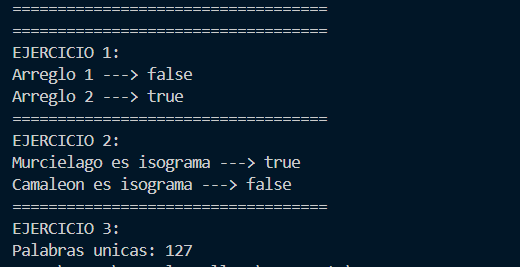

# Práctica de Algoritmos de Ordenamiento

## 📌 Información General

- **Título:** Sets
- **Asignatura:** Estructura de Datos  
- **Carrera:** Computación  
- **Estudiantes:** Israel Orellana 
- **Fecha:** 1 de julio del 2025  
- **Profesor:** Ing. Pablo Torres  

---

# 🛠️ Proyecto: Comparación de Implementaciones de Set en Java

Este proyecto demuestra el uso práctico de distintas implementaciones de **`Set`** en Java, destacando sus propiedades y aplicándolas a casos concretos como ordenamiento, detección de duplicados, validación de isogramas y análisis de texto.

## 📦 Paquetes y Clases

- `controllers.Sets` → Comparación entre distintas implementaciones de `Set<String>`.
- `controllers.ContactoController` → Ordenamiento de objetos personalizados (`Contacto`) con `TreeSet` y comparadores.
- `controllers.Ejercicios` → Ejercicios con `HashSet` para detectar duplicados, isogramas y contar palabras únicas en un texto.

---

## 📌 Funcionalidades

### ✅ `HashSet`
- No garantiza el orden de los elementos.
- No permite duplicados.
- Alta eficiencia para búsquedas.
- **Ejemplo:** `Laptop`, `Manzana`, `Pera`, `Celular`, (se ignoran los duplicados).

### ✅ `LinkedHashSet`
- Mantiene el **orden de inserción**.
- No permite duplicados.
- Ideal cuando el orden en que se insertan los elementos es importante.
- **Ejemplo:** Inserta `"Laptop"`, `"Manzana"`, `"Pera"`, `"Celular"` → conserva ese orden.

### ✅ `TreeSet` (Orden Natural)
- Ordena los elementos **alfabéticamente**.
- No permite duplicados.
- Los elementos deben ser comparables.
- **Ejemplo:** `"Celular"`, `"Laptop"`, `"Manzana"`, `"Pera"`.

### ✅ `TreeSet` con Comparador por Longitud (Ascendente)
- Ordena las palabras por **longitud de menor a mayor**.
- Si dos palabras tienen la misma longitud, se ordenan **alfabéticamente**.
- **Ejemplo con palabras adicionales:** `"Pera"`, `"Laptop"`, `"Celular"`, `"Celulas"`.

### ✅ `TreeSet` con Comparador por Longitud (Descendente + Alfabético Inverso)
- Ordena por **longitud de mayor a menor**.
- En caso de empate, ordena **alfabéticamente al revés**.
- **Ejemplo:** `"Celulas"`, `"Celular"`, `"Laptop"`, `"Pera"`.

---

## 👥 Ordenamiento de Objetos Personalizados (`Contacto`)

### 📇 `TreeSet` con Comparador de Apellido → Nombre
Ordena los contactos primero por **apellido** y luego por **nombre**. Utiliza un `Comparator<Contacto>` externo.

**Salida esperada:**
Ana Perez 987654321
Luis Perez 111111111
Pedro Gonzales 123456789
Pedro Lopez 222222222

### 📇 `TreeSet` con Comparador de Apellido → Nombre → Teléfono (Inverso)
Ordena por **apellido**, luego **nombre** y luego **teléfono en orden descendente**.

**Salida esperada:**
Ana Perez 987654321
Luis Perez 111111111
Pedro Gonzales 123456789
Pedro Lopez 222222222

---

## 🧪 Ejercicios Adicionales con `Set`

### 🔁 Ejercicio 1: Detección de Duplicados
Detecta si un arreglo de enteros tiene valores repetidos usando `HashSet`.

### 🧬 Ejercicio 2: ¿Es un Isograma?
Verifica si una palabra no tiene letras repetidas (como "murciélago").

### 📊 Ejercicio 3: Contar Palabras Únicas en un Texto
Analiza un texto y cuenta cuántas **palabras únicas** tiene, ignorando repeticiones.

---

## 📝 Conclusión

Este proyecto sirve como una guía práctica para comprender:

- Las diferencias clave entre `HashSet`, `LinkedHashSet` y `TreeSet`.
- El uso de `Comparator` para personalizar el ordenamiento.
- La utilidad de los `Set` en la resolución de problemas reales como validación, análisis y organización de datos.

## 📈 Gráfico Generado

---
## 📈 SEGUNDO GRAFICO

---
## 📈 TERCER GRAFICO
