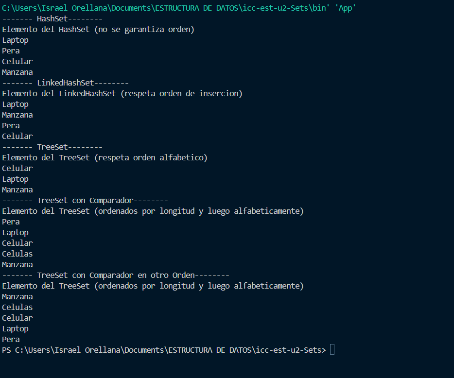
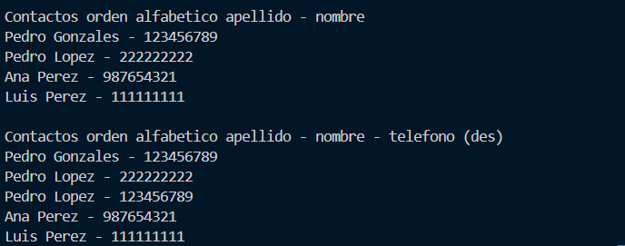

# Práctica de Algoritmos de Ordenamiento

## 📌 Información General

- **Título:** Sets
- **Asignatura:** Estructura de Datos  
- **Carrera:** Computación  
- **Estudiantes:** Israel Orellana 
- **Fecha:** 1 de julio del 2025  
- **Profesor:** Ing. Pablo Torres  

---

# 🛠️ Proyecto: Comparación de Implementaciones de Set en Java

Este proyecto demuestra el uso de distintas implementaciones de **`Set`** en Java, junto con el uso de comparadores personalizados para ordenar elementos de diferentes maneras.

## 📌 Funcionalidades

La clase `Sets` contiene métodos que construyen los siguientes tipos de `Set<String>`:

### ✅ `HashSet`
- No garantiza el orden de los elementos.
- No permite duplicados.
- Útil para operaciones rápidas de búsqueda.

### ✅ `LinkedHashSet`
- Mantiene el orden de inserción.
- No permite duplicados.
- Útil cuando se desea conservar el orden en que se insertaron los elementos.

### ✅ `TreeSet`
- Ordena automáticamente los elementos en orden **alfabético**.
- No permite duplicados.
- Requiere que los elementos sean comparables o se proporcione un comparador.

### ✅ `TreeSet` con Comparador Personalizado
- Ordena primero por **longitud** de palabra (de menor a mayor).
- Si dos palabras tienen la misma longitud, las ordena **alfabéticamente**.

### ✅ `TreeSet` con Comparador Inverso
- Ordena primero por **longitud** (de mayor a menor).
- En caso de empate, las ordena en orden **alfabético inverso**.

## 🔄 Elementos utilizados

Todos los conjuntos utilizan los mismos elementos de ejemplo, algunos de ellos duplicados, para mostrar cómo cada implementación maneja la duplicidad:

## 📈 Gráfico Generado

---
## 📈 SEGUNDO GRAFICO
